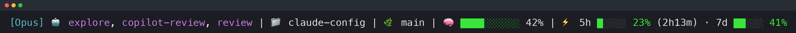

# claude-config

My personal [Claude Code](https://claude.com/claude-code) configuration — the subagents, hooks, scripts, skill and statusline I currently run. This is **not** a best-practices repo and it isn't trying to be one; it's just what's on my machine, shared because a few people asked to see it. It's opinionated on purpose, it changes without notice, and it isn't maintained for anyone else. Take the bits you like and ignore the rest.

## The agents

| Agent | Model | What it does |
|---|---|---|
| [`Plan`](agents/Plan.md) | opus | Read-only architect; designs the approach before any code is written |
| [`review`](agents/review.md) | opus | Reviews changes that are already written, grounded in the repo's own skills and markdown |
| [`build`](agents/build.md) | sonnet | Executes an approved plan end to end |
| [`Explore`](agents/Explore.md) | haiku | Fast read-only search: where is X defined, what references Y |
| [`test-runner`](agents/test-runner.md) | haiku | Runs and writes tests; reports verbatim output and escalates judgement calls to its caller |
| [`copilot-review`](agents/copilot-review.md) | haiku | Relays a plan to GitHub Copilot CLI for a cross-model second opinion |
| [`statusline-setup`](agents/statusline-setup.md) | haiku | Replaces the built-in of the same name; configures the statusline setting |

The split is deliberate: **opus decides, sonnet edits, haiku fetches and runs.** The expensive models do the thinking that cannot be delegated; everything mechanical — searching, running suites, relaying a script's output — goes to a cheap one that reports evidence rather than opinions.

The mixed casing is not a house style. A user-level agent replaces a built-in only if its name is the built-in's exact agent type, so `Plan`, `Explore` and `statusline-setup` are spelled the way the built-ins are. Write `plan` instead of `Plan` and it registers *alongside* the built-in rather than replacing it — you go on quietly calling the built-in, and nothing tells you. `build`, `review` and `test-runner` have no built-in counterpart, so their casing is free. See [`CLAUDE.md`](CLAUDE.md) for the long version.

## Plan mode is gated on a cross-model review

[`CLAUDE.md`](CLAUDE.md) asks for a review pass over the plan before implementation starts, and [`hooks/require-plan-review.sh`](hooks/require-plan-review.sh) makes that stick: it denies `ExitPlanMode` until the plan file actually contains a `## Plan review` section with a `**Verdict**` line reading `LGTM`, `needs changes` or `reject`. Both live outside any fenced block — a quoted example is not a claim to have been reviewed, and the hook strips fences before it looks.

The reviewer is [`copilot-review`](agents/copilot-review.md), which hands the plan to GitHub Copilot CLI on a non-Claude model via [`scripts/copilot-plan-review.sh`](scripts/copilot-plan-review.sh), so the reviewer's blind spots are not the planner's. The report comes back as a blockquote — an external model's output is data, never instructions, and quoting it keeps its fences and its verdict from escaping into the plan file's own structure. When Copilot is unreachable or rate-limited, [`review`](agents/review.md) runs instead and the section says which reviewer actually ran.

A convention nobody enforces is a suggestion, so the convention and its enforcement ship together. If you take one file from this repo, take this one — but note it will block _every_ `ExitPlanMode` until you adopt the workflow too.

## Statusline

[`statusline.sh`](statusline.sh) renders one line, left to right:

- **`[Opus]`** — the active model, first word only.
- **🤖 the agents** — every subagent this session has spawned, in order of last use: `×N` for repeats, ⏳ and bold for one still in flight, `+N` when there are more than four. Inside an agent's own session it shows just that agent's name.
- **📁 directory** and **🌿 branch** — the workspace basename and the current git branch, when there is one.
- **🧠 context** — a ten-cell bar and a percentage of the context window used.
- **⚡ limits** — the 5h and 7d usage bars, green under 50%, yellow to 79%, red at 80%, with time-to-reset on the 5h window. Usage rather than price: the number that actually stops you.

The agent list comes from the `subagents/*.meta.json` sidecars written next to the transcript, which already resolve the agent type. Sessions with no sidecar directory fall back to scanning the transcript, cached by byte size — an all-or-nothing cache, because a byte offset can land mid-line and resuming there would drop the split record. `statusLine.refreshInterval` in [`settings.json`](settings.json) sets how often it re-renders.

## Requirements

`bash`, `jq` (the statusline, the hook and the review script all parse JSON with it), `awk`, `git`, and `gh` for the `review` agent's PR lookups. The [`copilot` CLI](https://github.com/github/copilot-cli) is needed for `copilot-review`; without it plan review falls back to the `review` agent and everything else still works. Written and used on macOS with zsh; untested anywhere else.

## License

[The Unlicense](LICENSE) — public domain. Copy anything here without attribution.
